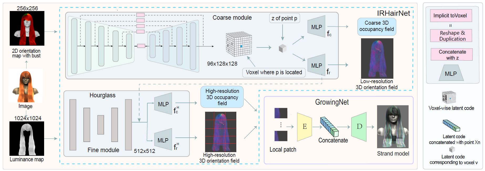

# NeuralHDHair
The source code of the networks for our paper ["NeuralHDHair: Automatic High-fidelity Hair Modeling from a Single Image Using Implicit Neural Representations"](https://openaccess.thecvf.com/content/CVPR2022/papers/Wu_NeuralHDHair_Automatic_High-Fidelity_Hair_Modeling_From_a_Single_Image_Using_CVPR_2022_paper.pdf) (CVPR2022)

# Pipeline #

# Prerequisites

- Linux
- Python 3.8
- Pytorch 1.8.1
- NVIDIA GPU + CUDA 11.1

# Train #
1.Train Coarse module

    python main.py --name=yourname --model_name=HairSpatNet --blur_ori --no_use_depth --no_use_L --gpu_ids=0 --batch_size=1
2.Train Global module

    python main.py --name=yourname --model_name=HairModelingHD --blur_ori --no_use_depth  --gpu_ids=0 --batch_size=1 --pretrain_path=pretrain_model_path

3.Train GrowingNet 

    python main.py --name=yourname --model_name=GrowingNet  --batch_size=1 --sd_per_batch=800 --pt_per_strand 72

# Tips #
1.Data, some data processing and rendering code do not have permissions and cannot open source temporarily.

2.Use high-quality images as much as possible, the quality of reconstruction depends largely on the quality of  generated orientation map.

3.The hair should be aligned with the bust as much as possible, you may need the face alignment algorithm to calculate the affine transformation.(data/Train_input/DB1 contains standard input samples)

# Related works #
The latest work [MonoHair](https://keyuwu-cs.github.io/MonoHair/)
For Dynamic hair modeling [DynamicHair](https://github.com/Lingchen-chen/Dynamic-Hair)

# Citation #
    @inproceedings{wu2022neuralhdhair,
    title={NeuralHDHair: Automatic High-fidelity Hair Modeling from a Single Image Using Implicit Neural Representations},
    author={Wu, Keyu and Ye, Yifan and Yang, Lingchen and Fu, Hongbo and Zhou, Kun and Zheng, Youyi},
    booktitle={Proceedings of the IEEE/CVF Conference on Computer Vision and Pattern Recognition},
    pages={1526--1535},
    year={2022}
    }

  
  
